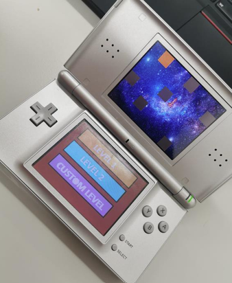

# Rocket Rider (Nintendo DS)

## Overview

Rocket Rider is a Nintendo DS game developed in C using low-level ARM9 programming.

The project focuses on real-time control, rendering, and interaction with constrained hardware. It demonstrates embedded-style development applied to game systems, including graphics handling, input processing, audio integration, and structured game-loop design.

## Demo



## Features

- Real-time rocket control
- Rendering for the Nintendo DS
- Movement and collision logic
- Audio playback
- Structured game loop and game state handling

## Tech Stack

- **Language:** C
- **Platform:** Nintendo DS (ARM9)
- **Libraries:** libnds
- **Toolchain:** devkitARM
- **Build system:** Makefile

## Project Structure

```text
rocket-rider/
├── source/                # Core game logic
├── include/               # Header files, if used
├── assets/
│   ├── images/            # Screenshots / visuals
│   └── audio/             # Audio assets
├── docs/
│   └── presentation.pdf   # Optional presentation
├── Makefile
├── README.md
└── RocketRider.nds        # Optional compiled ROM
```

## Build and Run

### Requirements

- devkitARM
- libnds
- A Nintendo DS emulator such as DeSmuME, or real hardware

### Build

```bash
make
```

### Run

Open the generated `.nds` file in an emulator such as **DeSmuME**, or run it on a Nintendo DS using a compatible flash cartridge.

## Current Status

### Working

- Core gameplay loop
- Input handling
- Rendering
- Audio playback

### Limitations

- Limited level complexity
- Basic physics and collision handling
- Minimal menus or UI polish
- Limited robustness to edge cases

## Learning Outcomes

This project demonstrates:

- Low-level programming on constrained hardware
- Real-time system design
- Graphics and memory management on Nintendo DS
- Structured C project organization using a Makefile-based workflow

## Authors

- Charlotte Heibig
- Ismael Frei
